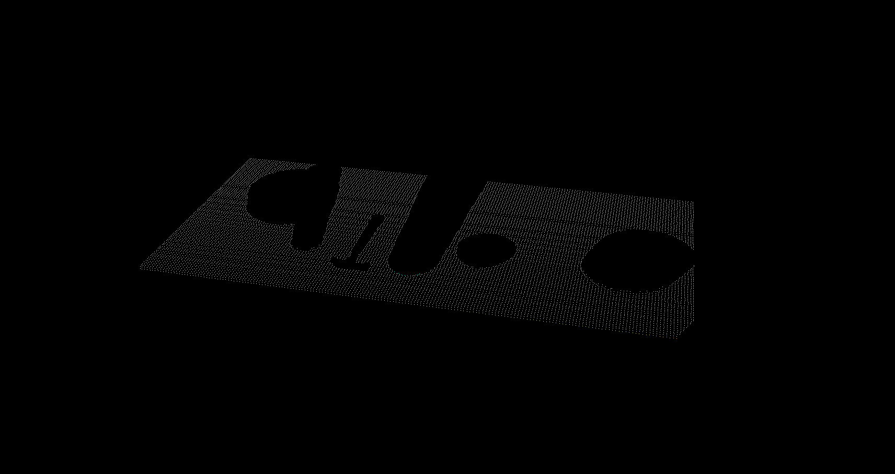
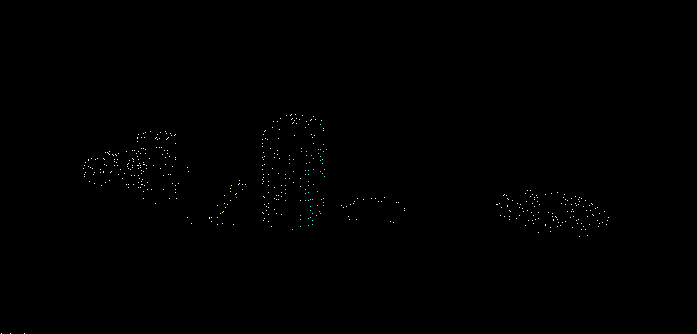
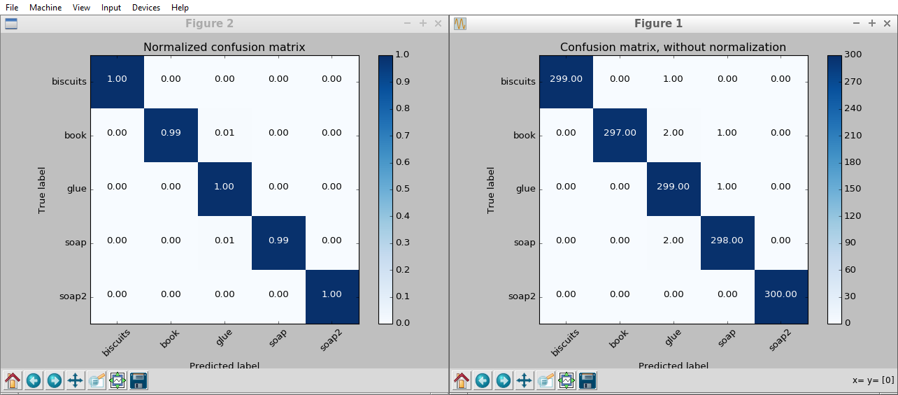
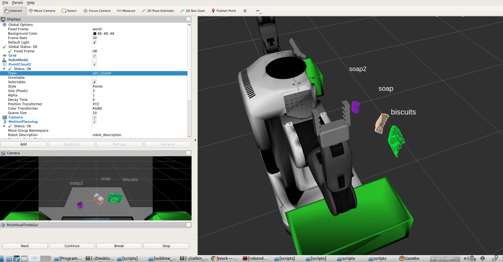
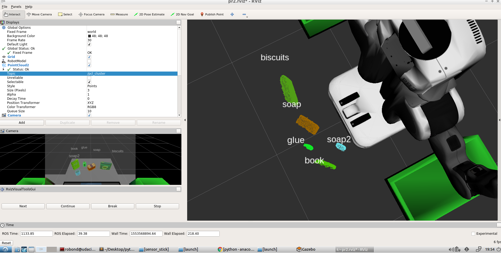
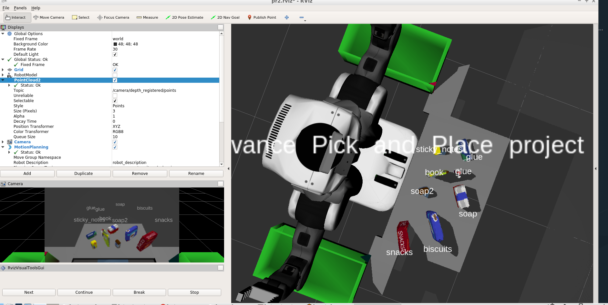

## Project: Perception Pick & Place
### Writeup Template: You can use this file as a template for your writeup if you want to submit it as a markdown file, but feel free to use some other method and submit a pdf if you prefer.

---

# Required Steps for a Passing Submission:
1. Extract features and train an SVM model on new objects (see `pick_list_*.yaml` in `/pr2_robot/config/` for the list of models you'll be trying to identify). 
2. Write a ROS node and subscribe to `/pr2/world/points` topic. This topic contains noisy point cloud data that you must work with.
3. Use filtering and RANSAC plane fitting to isolate the objects of interest from the rest of the scene.
4. Apply Euclidean clustering to create separate clusters for individual items.
5. Perform object recognition on these objects and assign them labels (markers in RViz).
6. Calculate the centroid (average in x, y and z) of the set of points belonging to that each object.
7. Create ROS messages containing the details of each object (name, pick_pose, etc.) and write these messages out to `.yaml` files, one for each of the 3 scenarios (`test1-3.world` in `/pr2_robot/worlds/`).  [See the example `output.yaml` for details on what the output should look like.](https://github.com/udacity/RoboND-Perception-Project/blob/master/pr2_robot/config/output.yaml)  
8. Submit a link to your GitHub repo for the project or the Python code for your perception pipeline and your output `.yaml` files (3 `.yaml` files, one for each test world).  You must have correctly identified 100% of objects from `pick_list_1.yaml` for `test1.world`, 80% of items from `pick_list_2.yaml` for `test2.world` and 75% of items from `pick_list_3.yaml` in `test3.world`.
9. Congratulations!  Your Done!

# Extra Challenges: Complete the Pick & Place
7. To create a collision map, publish a point cloud to the `/pr2/3d_map/points` topic and make sure you change the `point_cloud_topic` to `/pr2/3d_map/points` in `sensors.yaml` in the `/pr2_robot/config/` directory. This topic is read by Moveit!, which uses this point cloud input to generate a collision map, allowing the robot to plan its trajectory.  Keep in mind that later when you go to pick up an object, you must first remove it from this point cloud so it is removed from the collision map!
8. Rotate the robot to generate collision map of table sides. This can be accomplished by publishing joint angle value(in radians) to `/pr2/world_joint_controller/command`
9. Rotate the robot back to its original state.
10. Create a ROS Client for the “pick_place_routine” rosservice.  In the required steps above, you already created the messages you need to use this service. Checkout the [PickPlace.srv](https://github.com/udacity/RoboND-Perception-Project/tree/master/pr2_robot/srv) file to find out what arguments you must pass to this service.
11. If everything was done correctly, when you pass the appropriate messages to the `pick_place_routine` service, the selected arm will perform pick and place operation and display trajectory in the RViz window
12. Place all the objects from your pick list in their respective dropoff box and you have completed the challenge!
13. Looking for a bigger challenge?  Load up the `challenge.world` scenario and see if you can get your perception pipeline working there!

## [Rubric](https://review.udacity.com/#!/rubrics/1067/view) Points
### Here I will consider the rubric points individually and describe how I addressed each point in my implementation.  

---
### Writeup / README

#### 1. Provide a Writeup / README that includes all the rubric points and how you addressed each one.  You can submit your writeup as markdown or pdf.  

You're reading it!

### Exercise 1, 2 and 3 pipeline implemented

#### 1. Complete Exercise 1 steps. Pipeline for filtering and RANSAC plane fitting implemented.

#### Import PCL module

    import pcl

#### Load Point Cloud file

    cloud = pcl.load_XYZRGB('tabletop.pcd')

#### a- Voxel Grid filter

    # Create a VoxelGrid filter object for our input point cloud
    vox = cloud.make_voxel_grid_filter()

    # Choose a voxel (also known as leaf) size
    LEAF_SIZE = 0.01   

    # Set the voxel (or leaf) size  
    vox.set_leaf_size(LEAF_SIZE, LEAF_SIZE, LEAF_SIZE)
    
    # Call the filter function to obtain the resultant downsampled point cloud
    cloud_filtered = vox.filter()
    filename = 'voxel_downsampled.pcd'
    pcl.save(cloud_filtered, filename)

#### b- PassThrough filter

    # PassThrough filter
    # Create a PassThrough filter object.
    passthrough = cloud_filtered.make_passthrough_filter()

    # Assign axis and range to the passthrough filter object.
    filter_axis = 'z'
    passthrough.set_filter_field_name(filter_axis)
    axis_min = 0.6
    axis_max = 1.1
    passthrough.set_filter_limits(axis_min, axis_max)

    # Finally use the filter function to obtain the resultant point cloud. 
    cloud_filtered = passthrough.filter()
    filename = 'pass_through_filtered.pcd'
    pcl.save(cloud_filtered, filename)

#### c- RANSAC plane segmentation // Extract inliers

    # Create the segmentation object
    seg = cloud_filtered.make_segmenter()

    # Set the model you wish to fit 
    seg.set_model_type(pcl.SACMODEL_PLANE)
    seg.set_method_type(pcl.SAC_RANSAC)

    # Max distance for a point to be considered fitting the model
    # Experiment with different values for max_distance 
    # for segmenting the table
    max_distance = 0.04
    seg.set_distance_threshold(max_distance)

    # Call the segment function to obtain set of inlier indices and model coefficients
    inliers, coefficients = seg.segment()

    extracted_inliers = cloud_filtered.extract(inliers, negative=False)
    filename = 'extracted_inliers.pcd'
    pcl.save(extracted_inliers, filename)

    # Save pcd for table
    #pcl.save(cloud, filename)

#### d-Extract outliers

 
    
    extracted_outliers = cloud_filtered.extract(inliers, negative=True)
    filename = 'extracted_outliers.pcd'
    pcl.save(extracted_outliers, filename)
    

#### 2. Complete Exercise 2 steps: Pipeline including clustering for segmentation implemented.  

The goal is to write a ROS node that takes in the camera data as a point cloud, filters that point cloud, then segments the individual objects using Euclidean clustering

#### A- publish the point cloud:

ROS node initialization

    rospy.init_node('clustering', anonymous=True)
    
Create Subscribers

    pcl_sub = rospy.Subscriber("/sensor_stick/point_cloud", pc2.PointCloud2, pcl_callback, queue_size=1)
    
Create Publishers

    pcl_objects_pub = rospy.Publisher("/pcl_objects", PointCloud2, queue_size=1)
    pcl_table_pub = rospy.Publisher("/pcl_table", PointCloud2, queue_size=1)
    
Spin while node is not shutdown

    while not rospy.is_shutdown():
    rospy.spin()
    
Publish ROS msg

    pcl_objects_pub.publish(pcl_msg)
    pcl_table_pub.publish(pcl_msg)

#### B- Apply filters and perform RANSAC plane segmentation

    Use the code from the previous exercise to perform the proper filtering for the ROS node
    1- Downsample your point cloud by applying a Voxel Grid Filter.
    2- Apply a Pass Through Filter to isolate the table and objects.
    3- Perform RANSAC plane fitting to identify the table.
    4- Use the ExtractIndices Filter to create new point clouds containing the table and objects separately (I'll call them     cloud_table and cloud_objects going forward).

Convert ROS msg to PCL data

    cloud = ros_to_pcl(pcl_msg)

Convert PCL data to ROS msg

    ros_cloud_objects = pcl_to_ros(extracted_outliers) 
    ros_cloud_table = pcl_to_ros(extracted_inliers)
    
Publish ROS msg

    pcl_objects_pub.publish(ros_cloud_objects)
    pcl_table_pub.publish(ros_cloud_table) 
    
Inliers and Outliers shown in ROS
    

#### C- Cluster the objects:

use PCL's Euclidean Clustering algorithm to segment the remaining points into individual objects

The k-d tree data structure is used in the Euclidian Clustering algorithm to decrease the computational burden of searching for neighboring points. While other efficient algorithms/data structures for nearest neighbor search exist, PCL's Euclidian Clustering algorithm only supports k-d trees.

To construct a k-d tree

    1- convert your XYZRGB point cloud to XYZ, because PCL's Euclidean Clustering algorithm requires a point cloud with only        spatial information. 
    2- construct a k-d tree from the white cloud

Euclidean Clustering with a k-d tree and pcl//ROS

    white_cloud = XYZRGB_to_XYZ(extracted_outliers)# Apply function to convert XYZRGB to XYZ
    tree = white_cloud.make_kdtree()

    # TODO: Create Cluster-Mask Point Cloud to visualize each cluster separately ///////
    ec = white_cloud.make_EuclideanClusterExtraction()

    # Set tolerances for distance threshold 
    # as well as minimum and maximum cluster size (in points)
    # Your task is to experiment and find values that work for segmenting objects.
    ec.set_ClusterTolerance(0.05)
    ec.set_MinClusterSize(10)
    ec.set_MaxClusterSize(2500)

    # Search the k-d tree for clusters
    ec.set_SearchMethod(tree)
   
    # Extract indices for each of the discovered clusters
    cluster_indices = ec.Extract()
    

Choosing a unique color for each segmented Object called cluster cloud 

    cluster_color = get_color_list(len(cluster_indices))

    color_cluster_point_list = []

    for j, indices in enumerate(cluster_indices):
        for i, indice in enumerate(indices):
            color_cluster_point_list.append([white_cloud[indice][0],
                                        white_cloud[indice][1],
                                        white_cloud[indice][2],
                                         rgb_to_float(cluster_color[j])])

    #Create new cloud containing all clusters, each with unique color
    cluster_cloud = pcl.PointCloud_PointXYZRGB()
    cluster_cloud.from_list(color_cluster_point_list)

    ros_cluster_cloud = pcl_to_ros(cluster_cloud)

#### 2. Complete Exercise 3 Steps.  Features extracted and SVM trained.  Object recognition implemented.
Here is an example of how to include an image in your writeup.

#### Generating Features

launch the training.launch file to bring up the Gazebo environment

    $ cd ~/catkin_ws
    $ roslaunch sensor_stick training.launch

#### Capturing Features

a- run the capture_features.py script to capture and save features for each of the objects in the environment. 
b- This script spawns objects in random orientations 

   computes features based on the point clouds ( normals and hsv information )

    $ cd ~/catkin_ws
    $ rosrun sensor_stick capture_features.py

main bit of code for capture_feature.py

grab the normals

    def get_normals(cloud):
        get_normals_prox = rospy.ServiceProxy('/feature_extractor/get_normals', GetNormals)
        return get_normals_prox(cloud).cluster

loop through the objects import at random angles ( compute the histograms for hsv and normals )

    for model_name in models:
        spawn_model(model_name)

        for i in range(500): Increase this value to increase the number of times you capture features for each object.
            # make five attempts to get a valid a point cloud then give up
            sample_was_good = False
            try_count = 0
            while not sample_was_good and try_count < 5:
                sample_cloud = capture_sample()
                sample_cloud_arr = ros_to_pcl(sample_cloud).to_array()

                # Check for invalid clouds.
                if sample_cloud_arr.shape[0] == 0:
                    print('Invalid cloud detected')
                    try_count += 1
                else:
                    sample_was_good = True

            # Extract histogram features
            chists = compute_color_histograms(sample_cloud, using_hsv=True)
            normals = get_normals(sample_cloud)
            nhists = compute_normal_histograms(normals)
            feature = np.concatenate((chists, nhists))
            labeled_features.append([feature, model_name])

        delete_model()

when you call the compute_color_histograms code and compute_normal_histograms it calls these two functions in features.py

compute_color_histograms:

    def compute_color_histograms(cloud, using_hsv=False):

         # Compute histograms for the clusters
        point_colors_list = []

        # Step through each point in the point cloud
        for point in pc2.read_points(cloud, skip_nans=True):
            rgb_list = float_to_rgb(point[3])
            if using_hsv:
                point_colors_list.append(rgb_to_hsv(rgb_list) * 255)
            else:
                point_colors_list.append(rgb_list)

        # Populate lists with color values
        channel_1_vals = []
        channel_2_vals = []
        channel_3_vals = []

        for color in point_colors_list:
            channel_1_vals.append(color[0])
            channel_2_vals.append(color[1])
            channel_3_vals.append(color[2])
    
        #Compute histograms
        nbins=32
        bins_range=(0, 256)
        
        # Compute the histogram of the channels separately
        channel_1_hist = np.histogram(channel_1_vals, bins=nbins, range=bins_range)
        channel_2_hist = np.histogram(channel_2_vals, bins=nbins, range=bins_range)
        channel_3_hist = np.histogram(channel_3_vals, bins=nbins, range=bins_range)

        # TODO: Concatenate and normalize the histograms
         hist_features = np.concatenate((channel_1_hist[0], channel_2_hist[0], channel_1_hist[0])).astype(np.float64)

        # Generate random features for demo mode.  
        # Replace normed_features with your feature vector
        normed_features = hist_features / np.sum(hist_features) 

        return normed_features 

compute_normal_histograms:

    def compute_normal_histograms(normal_cloud):
        norm_x_vals = []
        norm_y_vals = []
        norm_z_vals = []

        for norm_component in pc2.read_points(normal_cloud,
                                              field_names = ('normal_x', 'normal_y', 'normal_z'),
                                              skip_nans=True):
            norm_x_vals.append(norm_component[0])
            norm_y_vals.append(norm_component[1])
            norm_z_vals.append(norm_component[2])

        # Compute histograms of normal values (just like with color)

        nbins=32
        bins_range=(-1, 1)
        
        # Compute the histogram of the channels separately
        norm_x_hist = np.histogram(norm_x_vals, bins=nbins, range=bins_range)
        norm_y_hist = np.histogram(norm_y_vals, bins=nbins, range=bins_range)
        norm_z_hist = np.histogram(norm_z_vals, bins=nbins, range=bins_range)

        # TODO: Concatenate and normalize the histograms
    
        # Concatenate the histograms into a single feature vector
        hist_features = np.concatenate((norm_x_hist[0], norm_y_hist[0], norm_z_hist[0])).astype(np.float64)
    
        # Normalize the result
        normed_features = hist_features / np.sum(hist_features) 

        # Generate random features for demo mode.  
        # Replace normed_features with your feature vector

        return normed_features

Train Your SVM

    # Load training data from disk
    training_set = pickle.load(open('training_set.sav', 'rb'))

    # Format the features and labels for use with scikit learn
    feature_list = []
    label_list = []

    for item in training_set:
        if np.isnan(item[0]).sum() < 1:
            feature_list.append(item[0])
            label_list.append(item[1])

    print('Features in Training Set: {}'.format(len(training_set)))
    print('Invalid Features in Training set: {}'.format(len(training_set)-len(feature_list)))

    X = np.array(feature_list)
    # Fit a per-column scaler
    X_scaler = StandardScaler().fit(X)
    # Apply the scaler to X
    X_train = X_scaler.transform(X)
    y_train = np.array(label_list)

    # Convert label strings to numerical encoding
    encoder = LabelEncoder()
    y_train = encoder.fit_transform(y_train)

#### Create classifier

    clf = svm.SVC(kernel='linear')

#### Set up 5-fold cross-validation 
k-Fold Cross-Validation. Cross-validation is a resampling procedure used to evaluate machine learning models on a limited data sample. The procedure has a single parameter called k that refers to the number of groups that a given data sample is to be split into. ... Take the group as a hold out or test data se

    n_splits = 5
    kf = KFold(len(X_train),
               shuffle=False,
               random_state=1)

#### Perform cross-validation 

    scores = cross_val_score(cv=kf,
                            estimator=clf,
                             X=X_train, 
                             y=y_train,
                            scoring='accuracy'
                            )
    print('Scores: ' + str(scores))
    print('Accuracy: %0.2f (+/- %0.2f)' % (scores.mean(), 2*scores.std()))

#### Gather predictions 

    predictions = cross_val_predict(cv=kf,
                                    estimator=clf,
                                    X=X_train, 
                                    y=y_train
                                    )

#### results from the testing: plot with the confusion matrix normalized vs regular results

01 - confision matrix 50 sampled shapes per object

.PNG)

02 - confision matrix 300 sampled shapes per object

.PNG)

03 - confision matrix 300 sampled shapes per object

clustered_objects:

 Use the code from the previous exercise to perform the proper filtering for the ROS node
 
1- Downsample your point cloud by applying a Voxel Grid Filter.
    
2- Apply a Pass Through Filter to isolate the table and objects.
    
3- Perform RANSAC plane fitting to identify the table.
    
4- Use the ExtractIndices Filter to create new point clouds containing the table and objects separately 
    
5- create some empty lists to receive labels and object point clouds:

    # Classify the clusters! (loop through each detected cluster one at a time)
    detected_objects_labels = []
    detected_objects = []

6- write a for loop to cycle through each of the segmented clusters:

    for index, pts_list in enumerate(cluster_indices):
        # Grab the points for the cluster from the extracted outliers (cloud_objects)
        pcl_cluster = extracted_outliers.extract(pts_list)
        # TODO: convert the cluster from pcl to ROS using helper function
        ros_cluster = pcl_to_ros(pcl_cluster)
        # Extract histogram features
        # TODO: complete this step just as is covered in capture_features.py
        chists = compute_color_histograms(ros_cluster, using_hsv=True)
        normals = get_normals(ros_cluster)
        nhists = compute_normal_histograms(normals)
        feature = np.concatenate((chists, nhists))
        #labeled_features.append([feature, model_name])

        # Make the prediction, retrieve the label for the result
        # and add it to detected_objects_labels list
        prediction = clf.predict(scaler.transform(feature.reshape(1,-1)))
        label = encoder.inverse_transform(prediction)[0]
        detected_objects_labels.append(label)

        # Publish a label into RViz
        label_pos = list(white_cloud[pts_list[0]])
        label_pos[2] += .4
        object_markers_pub.publish(make_label(label,label_pos, index))

        # Add the detected object to the list of detected objects.
        do = DetectedObject()
        do.label = label
        do.cloud = ros_cluster
        detected_objects.append(do)

    rospy.loginfo('Detected {} objects: {}'.format(len(detected_objects_labels), detected_objects_labels))
    
    # Publish the list of detected objects
    # This is the output you'll need to complete the upcoming project!
    detected_objects_pub.publish(detected_objects)

7- add the following code to create some new publishers and read in your trained model:

    # Load Model From disk
    model = pickle.load(open('model.sav', 'rb'))
    clf = model['classifier']
    encoder = LabelEncoder()
    encoder.classes_ = model['classes']
    scaler = model['scaler']

#### Final Output of Object Recognition:

.PNG)

#### Instructions For Running On Ubuntu Machine Terminal:

Exercise_01 ////////////////////////////////////////////////////////////////////////////
with 
python RANSAC.py

    pcl_viewer voxel_downsampled.pcd 

    pcl_viewer pass_through_filtered.pcd

    pcl_viewer extracted_inliers.pcd

    pcl_viewer extracted_outliers.pcd

Exercise_02 

    termincal_01
    $roscore

    terminal_02
    $ cd ~/catkin_ws2
    export GAZEBO_MODEL_PATH=~/catkin_ws2/src/sensor_stick/models
    $ source ~/catkin_ws2/devel/setup.bash
    roslaunch sensor_stick robot_spawn.launch

    terminal_03
    $ cd ~/catkin_ws2
    export GAZEBO_MODEL_PATH=~/catkin_ws2/src/sensor_stick/models
    $ source ~/catkin_ws2/devel/setup.bash
    ./segmentation.py

Exercise_03 

    Capture and Train Features 
    
    termincal_01
    $roscore

    terminal_02
    $ cd ~/catkin_ws2
    export GAZEBO_MODEL_PATH=~/catkin_ws2/src/sensor_stick/models
    $ source ~/catkin_ws2/devel/setup.bash
    $ roslaunch sensor_stick training.launch

    terminal_03
    $ cd ~/catkin_ws2
    export GAZEBO_MODEL_PATH=~/catkin_ws2/src/sensor_stick/models
    $ source ~/catkin_ws2/devel/setup.bash
    $ rosrun sensor_stick capture_features.py

    #run in terminal_03 once capture_features.py is complete
    rosrun sensor_stick train_svm.py
    
    Run Test in rviz
    
    termincal_01
    $roscore
    
    terminal_02
    $ cd ~/catkin_ws2
    export GAZEBO_MODEL_PATH=~/catkin_ws2/src/sensor_stick/models
    $ source ~/catkin_ws2/devel/setup.bash
    roslaunch sensor_stick robot_spawn.launch
    
    terminal_03
    $ cd ~/catkin_ws2
    export GAZEBO_MODEL_PATH=~/catkin_ws2/src/sensor_stick/models
    $ source ~/catkin_ws2/devel/setup.bash
    ./object_recognition.py

### Pick and Place Setup

#### 1. For all three tabletop setups (`test*.world`), perform object recognition, then read in respective pick list (`pick_list_*.yaml`). Next construct the messages that would comprise a valid `PickPlace` request output them to `.yaml` format.

1- copy your ./object_recognition.py into the proper places of  project_template.py

2- Update the proper function for exporting yaml files

    #function to load parameters and request PickPlace service in the project_template.py

    def pr2_mover(object_list):

        # Initialize variables
        test_scene_num = Int32()
        object_name    = String()
        pick_pose      = Pose()
        place_pose     = Pose()
        arm_name       = String()
        yaml_dict_list = []

        # Update test scene number based on the selected test.
        test_scene_num.data = 3

        # Get Parameters
        object_list_param = rospy.get_param('/object_list')
        dropbox_param     = rospy.get_param('/dropbox')

        # Calculate detected objects centroids.
        labels = []
        centroids = [] # to be list of tuples (x, y, z)
        for object in object_list:
            labels.append(object.label)
            points_arr = ros_to_pcl(object.cloud).to_array()
            centroids.append(np.mean(points_arr, axis=0)[:3])

        # Loop through the pick list
        for i in range(0, len(object_list_param)):

            # Read object name and group from object list.
            object_name.data = object_list_param[i]['name' ]
            object_group     = object_list_param[i]['group']

            # Select pick pose
            try:
                index = labels.index(object_name.data)
                print("got one")
            except ValueError:
                print "Object not detected: %s" %object_name.data
                continue

            pick_pose.position.x = np.asscalar(centroids[index][0])
            pick_pose.position.y = np.asscalar(centroids[index][1])
            pick_pose.position.z = np.asscalar(centroids[index][2])

            # Select place pose
            position = search_dictionaries('group', object_group, 'position', dropbox_param)
            place_pose.position.x = position[0]
            place_pose.position.y = position[1]
            place_pose.position.z = position[2]

            # Select the arm to be used for pick_place
            arm_name.data = search_dictionaries('group', object_group, 'name', dropbox_param)

            # Create a list of dictionaries for later output to yaml format
            yaml_dict = make_yaml_dict(test_scene_num, arm_name, object_name, pick_pose, place_pose)
            yaml_dict_list.append(yaml_dict)
            print(yaml_dict)

        # Output your request parameters into output yaml file
        yaml_filename = 'output_'+str(test_scene_num.data)+'.yaml'
        send_to_yaml(yaml_filename, yaml_dict_list)
        print("sent file")

        return

3- Run the Capture, Train Features, and pick list FInal Workflow for deploying the pr2 robot

    Capture and Train Features based on pick list
    
    termincal_01
    $roscore

    terminal_02
    $ cd ~/catkin_ws2
    export GAZEBO_MODEL_PATH=~/catkin_ws2/src/sensor_stick/models
    $ source ~/catkin_ws2/devel/setup.bash
    $ roslaunch sensor_stick training.launch

    terminal_03
    $ cd ~/catkin_ws2
    export GAZEBO_MODEL_PATH=~/catkin_ws2/src/sensor_stick/models
    $ source ~/catkin_ws2/devel/setup.bash
    $ rosrun sensor_stick capture_features.py

    #run in terminal_03 once capture_features.py is complete
    rosrun sensor_stick train_svm.py
    
    FInal Workflow for deploying the pr2 robot

    termincal_01
    $roscore
    
    termincal_02
    $ cd ~/catkin_ws2
    source ~/catkin_ws2/devel/setup.bash
    export GAZEBO_MODEL_PATH=~/catkin_ws2/src/RoboND-Perception-Project/pr2_robot/models:$GAZEBO_MODEL_PATH
    roslaunch pr2_robot pick_place_project.launch

    termincal_03
    $ cd ~/catkin_ws2
    source ~/catkin_ws2/devel/setup.bash
    export GAZEBO_MODEL_PATH=~/catkin_ws2/src/RoboND-Perception-Project/pr2_robot/models:$GAZEBO_MODEL_PATH
    rosrun pr2_robot project_template.py

#### 1- test for output_1 [ 3/3 ]

#### 2- test for output_2 [ 5/5 ]

#### 3- test for output_3 [ 7/8 ]

### Final Comments

All in all this was a really engaging project. It demanded a lot of control of the code and the organization of the code in order for 
it to be deployed properly. The next steps for me would be to work on outputing the the last output4.yaml and work on the collision avoidance algortithm for the extra steps. For now I am pleased with the object recognition and training of the captured features of the 
output1.yaml - output3.yaml files.

